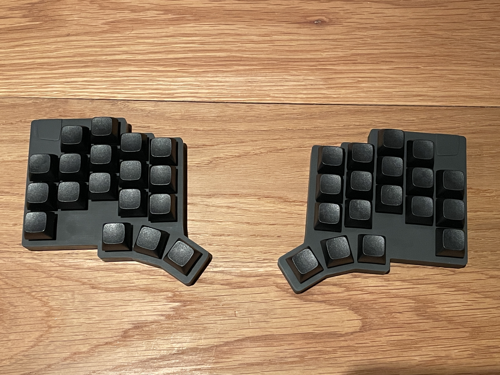

# My keyboard

## Overview
A keyboard built using ergogen etc.  36 keys wireless using the Seeed studio Xiao nRF52840 module.
This keyboard project heavily borrows from a few similar projects
- [triboard](https://github.com/tarneaux/triboard)
- [TOTEM](https://github.com/GEIGEIGEIST/TOTEM)

The main features of my board are:
- Split
- Wireless
- 36 keys: 5 columns x 3 rows + 3 thumb keys on each side
- Cherry MX switches with hotswap socket
- Uses the cheaper/smaller nordic mcu instead of nice nano
- The ergogen project generates two boards and cases (left and right)
  - The boards are not flippable as the battery charger pads on the mcu would not be reachable

## Images

## Guides
### Prerequisites
- `node` is setup to be run on the system
- For building cases: `npm install @jscad/csg` (this is a deprecated package so must be installed explicitly)

### How to generate the boards
`./build` (watches files and rebuilds when source changes/)

or

`./build once`

### How to generate the cases
`./build cases`

## TODO
- Increase the heat set insert radius as it is set with CA glue insted of being melted in (when printing with SLA resin)
- Add a printed part that slots over the switch and fits into the case allowing it to be easily comtrolled 